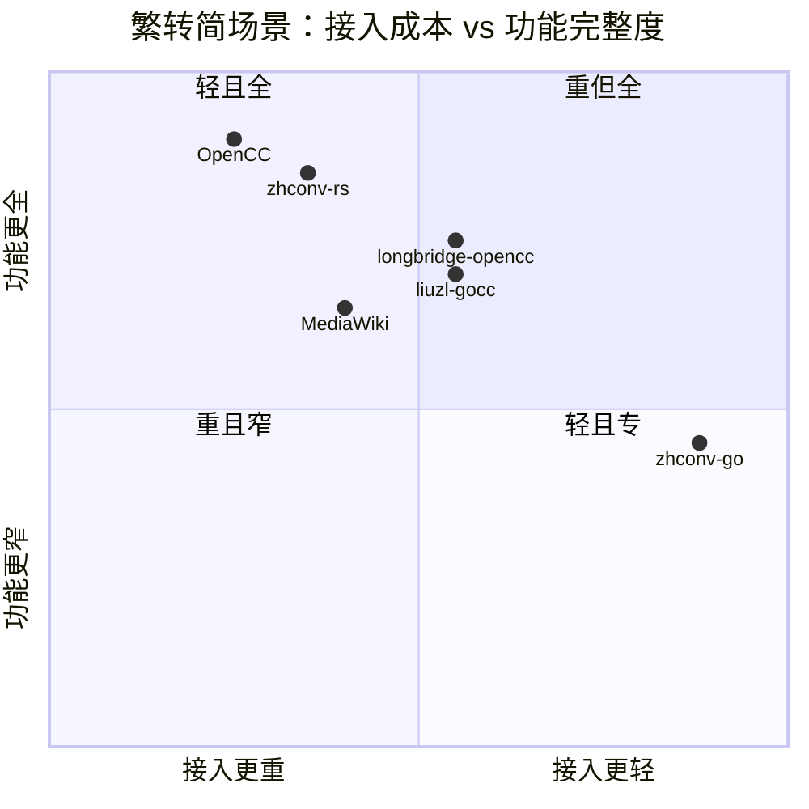
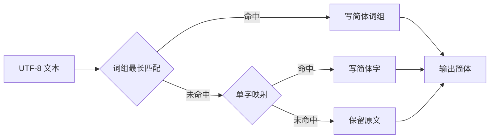
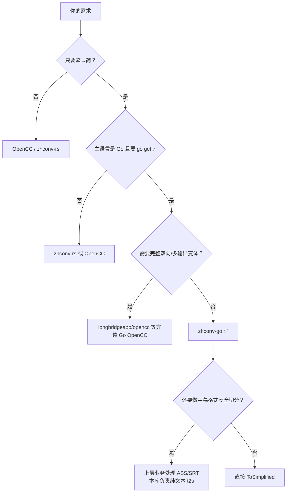

# 与主流方案对比

本文从**工程落地**视角对比 `zhconv-go` 与主流中文简繁转换方案。  
重点不是“谁功能最多”，而是：**在只做繁→简、要轻量、要可 `go get`、要适合字幕/文本处理时，谁更合适**。

> 对比结论是针对 **t2s（繁体转简体）** 场景。  
> 若你需要完整双向/多地区互转（`s2t`、`t2tw`、`s2hk`…），请优先看 OpenCC / zhconv-rs。

## 1. 对比对象

| 方案 | 语言/形态 | 定位 |
|---|---|---|
| **zhconv-go**（本项目） | 纯 Go 库 + CLI | 单向 t2s，轻量嵌入 |
| [OpenCC](https://github.com/BYVoid/OpenCC) | C++ 原版 | 工业级全功能简繁/地区转换 |
| [longbridgeapp/opencc](https://github.com/longbridgeapp/opencc) | 纯 Go（OpenCC 词表） | Go 侧较完整 OpenCC 能力 |
| [liuzl/gocc](https://github.com/liuzl/gocc) | 纯 Go | OpenCC 风格 Go 实现 |
| [zhconv-rs](https://github.com/Gowee/zhconv-rs) | Rust（另有 Py/JS） | 高性能多变体转换，MediaWiki/OpenCC 规则 |
| MediaWiki ZhConverter | PHP / 规则表 | 维基百科在线转换规则来源 |

## 2. 一张图看定位



解读：

- **右上**越理想，但现实里“又轻又全能”很难。
- `zhconv-go` 主动放弃双向/多目标，换取 **Go 原生、依赖少、API 小、热路径省资源**。

## 3. 能力雷达（t2s 场景主观评分）

评分仅相对“字幕/业务文本繁转简”场景（1-5，越高越好）：

```mermaid
%%{init: {'themeVariables': {'xyChart': {'plotColorPalette': '#2563eb, #16a34a, #f59e0b, #dc2626'}}}}%%
xychart-beta
    title "t2s 场景相对评分（越高越好）"
    x-axis [Go接入, 零CGO, 体积, 性能, 词组质量, 多地区输出, API简洁, 可维护]
    y-axis "分" 0 --> 5
    line [5, 5, 5, 4, 4, 2, 5, 5]
    line [2, 1, 3, 5, 5, 5, 3, 3]
    line [4, 5, 4, 4, 5, 4, 3, 3]
    line [1, 5, 4, 5, 5, 5, 3, 4]
```

对应序列（便于读图）：

| 维度 | zhconv-go | OpenCC(C++) | longbridge/opencc | zhconv-rs |
|---|---:|---:|---:|---:|
| Go 接入 | 5 | 2 | 4 | 1 |
| 零 CGO | 5 | 1 | 5 | 5（但非 Go） |
| 体积/资源 | 5 | 3 | 4 | 4 |
| 性能 | 4 | 5 | 4 | 5 |
| 词组/地区输入覆盖 | 4 | 5 | 5 | 5 |
| 多地区输出 | 2 | 5 | 4 | 5 |
| API 简洁 | 5 | 3 | 3 | 3 |
| 可维护（对本仓库） | 5 | 3 | 3 | 4 |

## 4. 多维对比表

### 4.1 工程接入

| 维度 | zhconv-go | OpenCC | longbridge/opencc | gocc | zhconv-rs |
|---|---|---|---|---|---|
| 主语言 | Go | C++ | Go | Go | Rust |
| `go get` 直接用 | ✅ | ❌ | ✅ | ✅ | ❌ |
| CGO | 无 | 常需绑定 | 无 | 无 | 无（非 Go） |
| 系统依赖 | 无 | 可能有 | 无 | 无 | Rust 工具链/CLI/WASM |
| 发布物 | 库 + 多平台 CLI | 库/发行包 | 库 | 库 | crate / CLI / Py / JS |
| 交叉编译友好 | ✅ | 一般 | ✅ | ✅ | 取决于接入方式 |

### 4.2 功能覆盖

| 维度 | zhconv-go | OpenCC | longbridge/opencc | zhconv-rs |
|---|---|---|---|---|
| 繁→简（t2s） | ✅ 核心目标 | ✅ | ✅ | ✅（zh-Hans/zh-CN） |
| 简→繁 | ❌ | ✅ | ✅ | ✅ |
| 台湾用语输入 | ✅（词组） | ✅ | ✅ | ✅ |
| 港台异体字输入 | ✅（字符反向） | ✅ | ✅ | ✅ |
| 输出 zh-TW/HK 变体 | ❌ | ✅ | ✅ | ✅ |
| MediaWiki 语法规则 | ❌ | 部分生态有 | 通常无 | ✅ |
| 自定义词表 | ✅ `Options` | ✅ | ✅ | ✅ |

### 4.3 性能与资源（量级对比，非严格同机竞技）

| 维度 | zhconv-go | OpenCC 系 | zhconv-rs |
|---|---|---|---|
| 设计目标吞吐 | 高（Go 热路径优化） | 很高 | 很高（AC 自动机） |
| 无变更输入分配 | **0 alloc** | 通常仍有开销 | 视实现 |
| 常驻词典规模 | ~50KB TSV embed + 内存索引 | 更大（全链路词典） | ~0.6–2.7MiB 压缩规则/自动机 |
| 启动成本 | 低（单例一次加载） | 中 | 低到中 |
| 并发模型 | 只读共享，天然安全 | 需注意实现 | 通常良好 |

本项目本机基准参考（v0.1.1）：

| Case | 结果 |
|---|---|
| 有转换 | ~100MB/s 量级，约 2 allocs/op |
| 无转换 | **0 B/op / 0 allocs/op** |

> 基准会随 CPU/文本内容波动；这里强调“无变更零分配”这一工程特性。

### 4.4 API 与可维护性

| 维度 | zhconv-go | 完整 OpenCC/zhconv |
|---|---|---|
| 核心 API 面 | 极小（`ToSimplified` / `Convert`） | 配置/词典链/多 profile |
| 心智负担 | 低 | 中高 |
| 出错面 | 少 | 多（方向、配置、词典链） |
| 适合业务嵌入 | 高 | 中（常需封装） |
| 适合做平台级转换中台 | 中低 | 高 |

### 4.5 安全与稳定性

| 维度 | zhconv-go | 说明 |
|---|---|---|
| nil receiver | 安全返回原输入 | 避免业务侧空指针扩散 |
| 非法 UTF-8 | 透传不 panic | 字幕脏数据更稳 |
| 默认实例失败 | 降级 identity，不 panic | 生产路径更稳 |
| 并发写词表 | 构造后只读 | 无锁查询 |

## 5. 流程对比图

### 5.1 zhconv-go（单向）



### 5.2 OpenCC 典型链路（多配置）


### 5.3 zhconv-rs 典型思路


## 6. 选型建议



### 一句话

| 场景 | 建议 |
|---|---|
| Go 服务里嵌繁转简，追求轻/稳/省 | **zhconv-go** |
| 需要完整简繁与地区配置矩阵 | OpenCC / zhconv-rs |
| Go 里要较完整 OpenCC 能力 | longbridgeapp/opencc |
| 多语言生态（Py/JS）统一规则 | zhconv-rs |

## 7. 对 Media Saber 的匹配度

| 需求 | zhconv-go | 完整转换引擎 |
|---|---|---|
| 字幕写入前繁转简 | ✅ 很贴 | 能做但偏重 |
| 依赖少、可维护 | ✅ | 一般 |
| 不引入 CGO | ✅ | OpenCC 原生不一定 |
| 未来扩展 ASS 安全层 | ✅ 库边界清晰 | 也可，但封装更厚 |
| 做通用翻译式转换中台 | 不足 | 更合适 |

## 8. 诚实边界（避免过度承诺）

`zhconv-go` **不是**下列替代品：

1. 完整 OpenCC 配置中心  
2. 翻译模型 / 语义润色  
3. 已内置 ASS/SRT 结构感知转换器（当前是纯文本层）

它的优势是：

- 目标窄  
- 路径短  
- 资源省  
- 接入快  
- 行为可预期  

## 9. 版本与基准说明

- 文档对应版本：`v0.1.1+`
- 词表：OpenCC 派生，见 `dict/NOTICE`
- 基准：开发机参考值，发版以 CI/本机 `go test -bench` 为准

---

**结论：**  
在“**Go + 仅繁转简 + 轻量高效 + 可维护**”约束下，`zhconv-go` 是更优解；  
在“**全变体/双向/跨语言规则统一**”约束下，应选 OpenCC 或 zhconv-rs。
