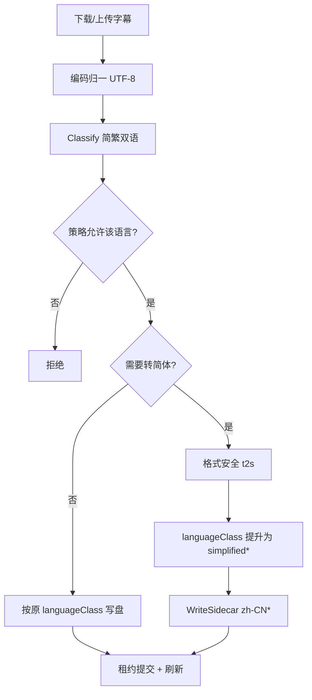

# Media Saber 接入设计（最优契合）

本文把 `zhconv-go` 放到 **media-saber-back-end** 现有字幕/元数据链路里评估，给出最小改动、最高收益的接入方式。  
**不在本仓库实现后端改动**；后端接入时以本文为准。

## 1. 后端现状（关键事实）

### 1.1 字幕主链路

```text
搜索/上传
  → Provider.Download / ExtractDownloadedSubtitle
  → ValidateChineseSubtitle(body, languageMode)   // 编码归一 + 简繁判定
  → commitSubtitleWrite
  → WriteSidecarForLanguage(path, format, languageClass, body, replace)
  → 媒体库刷新
```

关键代码：

| 环节 | 位置 | 现状 |
|---|---|---|
| 语言复验 | `internal/modules/subtitle/content.go` | 用 `gojianfan.S2T/T2S` **逐字**判断简/繁，不改写正文 |
| 写入 | `internal/modules/subtitle/writer.go` | 原子侧车写盘；后缀随 `languageClass` |
| 采用 | `SubtitleService.applyCandidate` | 下载 → 复验 → 写盘 |
| 上传 | `ApplyUploadedSubtitle` | 解包 → 同一套复验/写盘 |
| 策略 | `LanguageMode*` | 严格简体 / 简体后备双语 / 允许繁体等 |

### 1.2 现有繁简能力（gojianfan）

后端已依赖 `github.com/siongui/gojianfan`，用途分散：

| 位置 | 用法 | 特点 |
|---|---|---|
| `subtitle/content.go` | 逐字 `S2T`/`T2S` 统计简繁 | 只分类，不改写字幕 |
| `metadata/anime.go` | `T2S(CnName)` | 短字符串 |
| `plugin/plex_playlist_importer_match.go` | `T2S(text)` | 匹配归一 |
| `wordsanitize` | 手写少量繁体替换 | 违禁词场景，与字幕无关 |

结论：

- 后端**已有** t2s，但字幕路径**故意只识别不转换**
- 严格简体策略下，**纯繁体字幕会被拒写**（`ValidateSimplifiedChineseRejectsTraditional`）
- 这正是产品痛点：能找到繁体字幕却无法落成「纯简体侧车」

### 1.3 产品语义

| 状态 | 含义 |
|---|---|
| `LanguageStateMissing` | 缺可用中文 |
| `LanguageStateFallback` | 有繁体/双语等后备，可播 |
| `LanguageStatePreferred` | 已有纯简体 |
| `SearchIntentPreferredUpgrade` | 后备 → 低频升级纯简体 |

`TaskOperationTranslate` 已预留给「英→简」AI 翻译；**繁→简规则转换**更适合做成写路径的轻量步骤，而不是翻译任务。

## 2. 为什么 zhconv-go 比继续堆 gojianfan 更合适

| 维度 | gojianfan（现状） | zhconv-go |
|---|---|---|
| 词组（軟體/伺服器/記憶體…） | 弱/基本无 | ✅ 词组最长匹配 |
| 台港异体输入 | 一般 | ✅ 反向 variants |
| 热路径分配 | 未针对大文本优化 | 无变更 0 alloc / 有变更 1 alloc |
| 字幕长文本 | 可用但不理想 | 专为 t2s 文本优化 |
| 依赖形态 | 已有传递依赖 | 纯 Go、可 `go get`、版本钉死 |
| 双向能力 | 有 S2T | 不做（字幕写入只需 t2s） |
| 与分类逻辑 | 已用于分类 | **不要直接替换分类**（见下） |

分类阶段仍可能短期保留 gojianfan（或逐步换成「是否命中 t2s 字符表」启发式），  
**转换阶段**用 zhconv-go，边界清晰：

```text
classify  → 判断简/繁/双语
convert → 仅当策略要求「写入简体」且内容为繁体(可含双语)时改写对白
write   → 按转换后的 languageClass 落盘
```

## 3. 最优接入点（推荐）

### 3.1 唯一主接入：写路径转换器

在 `ValidateChineseSubtitle` **之后**、`WriteSidecarForLanguage` **之前**插入：

```text
validatedBody, languageClass, err := ValidateChineseSubtitle(...)
bodyToWrite, writeClass, converted, err := MaybeConvertToSimplified(validatedBody, languageClass, policy)
WriteSidecarForLanguage(..., writeClass, bodyToWrite, ...)
```

建议新文件（后端）：

```text
internal/modules/subtitle/convert_zh.go
```

职责：

1. 读完全文（字幕已有 `maxSubtitleSize = 20MiB` 上限；实际常见 ≪ 1MiB）  
2. 按格式安全转换（SRT/ASS 见 3.2）  
3. 输出 UTF-8 bytes + 新的 `languageClass`  
4. 幂等：已是简体则 0 alloc 透传

**不要**改：

- Provider 搜索/评分（仍可按上游真实语言排序）  
- 扫描已有侧车的分类（历史文件保持原样）  
- `WriteSidecar` 原子写语义

### 3.2 格式安全层（必须在后端，不在 zhconv-go）

| 格式 | 策略 |
|---|---|
| **SRT/VTT** | 时间轴/序号行跳过；对白行 `ToSimplified` |
| **ASS/SSA** | 仅 `Dialogue:` 第 10 段（文本列）转换；`Style`/`Script Info`/override 标签 `{\...}` 内不转或整段保护 |
| **其它** | 默认「全量 t2s」+ 测试兜底；未知格式可拒绝转换只原样写 |

实现建议：

```go
// 伪代码
func ConvertSubtitleToSimplified(format string, data []byte) ([]byte, error) {
    switch normalizeFormat(format) {
    case "srt", "vtt":
        return convertLineOriented(data, isSRTMetaLine)
    case "ass", "ssa":
        return convertASSDialogue(data)
    default:
        return []byte(zhconv.ToSimplified(string(data))), nil
    }
}
```

库边界：

- **zhconv-go**：纯文本 t2s  
- **subtitle 模块**：格式感知切分 + 策略开关

### 3.3 策略开关（产品契合）

建议策略字段（可渐进，不一次上齐）：

| 选项 | 行为 |
|---|---|
| `ConvertTraditionalToSimplified=false`（默认保守） | 与现网一致：繁体可作 fallback 落 `zh-TW` 或拒绝（视 LanguageMode） |
| `=true` | 写盘前把 traditional / traditional_multilingual **转为简体对白**，后缀落 `zh-CN` / `zh-CN.bilingual` 等 |

推荐默认演进：

1. **Phase A**：仅 `LanguageMode` 允许繁体后备时，**人工采用/上传**可勾选「转简体后写入」  
2. **Phase B**：策略级默认开启：`preferred_upgrade` 找不到纯简体时，对高分繁体候选 **转换后写入** 并标 `preferred`  
3. **Phase C**：严格简体模式也可「转换采用」，减少空窗

落盘后 `languageClass`：

| 转换前 | 转换后 |
|---|---|
| `traditional` | `simplified` |
| `traditional_multilingual` | `simplified_bilingual` 或 `simplified_multilingual`（保留「有外文」信号） |
| 已是 simplified* | 不变（no-op） |

任务结果文案示例：

- `繁体字幕已转换为简体并写入`  
- `reason_code`: `converted_traditional`（便于统计）

### 3.4 与现有状态机的契合



`preferred_upgrade` 路径：

- 原：只找「天生纯简体」  
- 优：高分繁体 + 转换成功 ⇒ 视作 preferred 达成  

无需新 TaskOperation；可在 apply 成功消息中区分。

## 4. 其它 gojianfan 调用点（次优、可后置）

| 调用点 | 是否优先换 zhconv |
|---|---|
| 字幕写路径 | **是，第一优先** |
| `metadata/anime.go` 标题 | 可，短文本；统一依赖后顺手换 |
| Plex playlist 匹配归一 | 可，短文本 |
| `content.go` 分类 | **谨慎**：分类要的是「是否含简/繁字形证据」，不是全文转换；可继续 gojianfan 或用字符表探测，**独立于写路径** |
| wordsanitize 违禁词 | 不换；场景不同 |

长期可淘汰 gojianfan 的前提：

1. 写路径 + 元数据 + 播放列表匹配都迁完  
2. 分类改为「字表/启发式」不依赖 S2T 全表  
3. 回归测试覆盖 `content_test.go` 全套

## 5. 依赖与版本

后端 `go 1.26`，与 zhconv-go 一致。

```bash
# media-saber-back-end
go get github.com/xylplm/zhconv-go@v0.1.1   # 或更新 tag
```

建议：

- **钉版本号**（勿 `@latest` 进生产）  
- 词表更新跟 zhconv-go release，不在后端内嵌第二份词典  
- 进程内只用 `zhconv.Default()`（`sync.Once`，并发安全）

资源预期（字幕任务线程）：

- 常驻：字符/词组索引（约数千项，MB 级以下）  
- 单次：已是简体 → 0 alloc；需转换 → 1 块输出缓冲  
- 与 20MiB 上限、下载超时相比可忽略

## 6. 推荐代码骨架（后端落地时）

```go
package subtitle

import (
    "bytes"
    "io"

    "github.com/xylplm/zhconv-go"
)

// ConvertPolicy 控制是否在写盘前做繁→简。
type ConvertPolicy struct {
    Enabled bool
}

// PrepareBodyForWrite 在 Validate 之后调用。
// 返回写盘 body、落盘 languageClass、是否发生了转换。
func PrepareBodyForWrite(body io.Reader, format, languageClass string, pol ConvertPolicy) (io.Reader, string, bool, error) {
    if !pol.Enabled || !shouldConvert(languageClass) {
        return body, languageClass, false, nil
    }
    raw, err := io.ReadAll(io.LimitReader(body, maxSubtitleSize+1))
    if err != nil {
        return nil, languageClass, false, err
    }
    if len(raw) == 0 || int64(len(raw)) > maxSubtitleSize {
        return nil, languageClass, false, errInvalidSubtitleSize
    }
    out, err := ConvertSubtitleToSimplified(format, raw)
    if err != nil {
        return nil, languageClass, false, err
    }
    // 幂等：无变化则保持原 class
    if bytes.Equal(out, raw) {
        return bytes.NewReader(raw), languageClass, false, nil
    }
    return bytes.NewReader(out), promoteToSimplifiedClass(languageClass), true, nil
}

func shouldConvert(class string) bool {
    switch class {
    case LanguageTraditional, LanguageTraditionalMultilingual:
        return true
    default:
        return false
    }
}

func promoteToSimplifiedClass(class string) string {
    switch class {
    case LanguageTraditionalMultilingual:
        return LanguageSimplifiedMultilingual // 或 bilingual，按外文类型再细分
    default:
        return LanguageSimplified
    }
}
```

`applyCandidate` / `ApplyUploadedSubtitle` 仅增加 3～5 行接线；策略来自 `SubtitleLibraryPolicy` 新字段或先用 feature flag。

## 7. 测试矩阵（接入验收）

| 用例 | 期望 |
|---|---|
| 纯简体 SRT | 不转换，原样写，0 逻辑变更 |
| 纯繁体 SRT + 开关开 | 对白变简体，后缀 `.zh-CN.srt` |
| 繁英双语 | 中文变简、英文保留 |
| ASS Dialogue + Style | 仅 Dialogue 文本变；Style 名/颜色不变 |
| ASS `{\pos..}` 标签 | 标签内不乱转 |
| 已简体 + 开关开 | no-op，hash 稳定 |
| 开关关 + 允许繁体 | 仍写 `.zh-TW` |
| 非法 UTF-8 残留 | 与 zhconv 一致透传，不 panic |
| 并发 apply | Default 单例安全 |
| `preferred_upgrade` 转换成功 | 状态 preferred，reason 可区分 |

## 8. 分阶段落地（建议）

| 阶段 | 内容 | 风险 |
|---|---|---|
| **P0** | 引入依赖 + `convert_zh.go` 格式安全 + 单测 | 低 |
| **P1** | 策略开关（默认关）+ 手动采用/上传可选转简 | 低 |
| **P2** | `preferred_upgrade` 自动转换采用 | 中（产品确认） |
| **P3** | 元数据/playlist 替换 gojianfan T2S | 低 |
| **P4** | 评估去掉 gojianfan | 中（分类回归） |

## 9. 明确不做

1. 在 Provider 侧预处理字幕（浪费下载、难回放）  
2. 转换内封字幕轨（无本地文件权）  
3. 把 zhconv 做成远程服务（本地库足够）  
4. 在 zhconv-go 内实现完整 ASS 状态机（业务层负责）  
5. 用转换替代「真·纯简体字幕源」的搜索优先级（搜索仍优先原生简体）

## 10. 契合度总结

| 目标 | 契合方式 |
|---|---|
| 用户要简体侧车 | 写前 t2s，后缀 zh-CN |
| 不破坏现有严格策略 | 默认关；校验后、写入前 |
| 高性能 | Default 单例 + 简体 0 alloc |
| 低资源 | 无 CGO，词表已嵌在库内 |
| 可维护 | 单文件转换层 + 策略字段 |
| 可演进 | 与 `TaskOperationTranslate` 英译路径并列 |

**一句话**：`zhconv-go` 应作为字幕模块的 **写路径繁→简引擎**，格式切分与策略留在 `internal/modules/subtitle`；先可选开关，再接到 `preferred_upgrade`，最后收敛 gojianfan。
